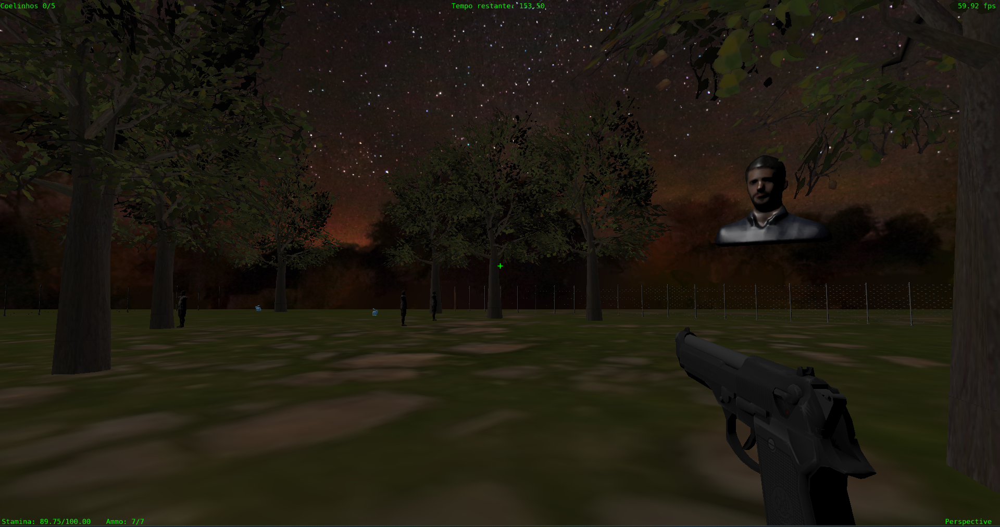

# Mal Residente -1
## Descrição
- O presente projeto trata-se de um jogo 3D desenvolvido para a cadeira de Fundamentos de Computação Gráfica no curso de graduação Ciência da Computação da Universidade Federal do Rio Grande do Sul.
- A implementação foi feita na linguagem C++, fazendo uso das bibliotecas OpenGL(glfw e glm).
- A ambientação do jogo é baseada na famosa série de jogos Resident Evil. O jogador está no corpo de Leon S. Kennedy, o famoso personagem da franquia. O seu objetivo, dessa vez, não é proteger a Ashley Graham, mas sim capturar os famosos coelhinhos de Stanford na floresta! O grande problema é que ela está infestada de monstros terríveis e Leon não pode ser infectado por eles, qualquer golpe é fatal! Contudo, Leon está equipado com uma potente Desert Eagle para se defender dos perigos da noite. Será que ele conseguirá sobreviver e voltar com todos os coelinhos para casa?
## Participação no Desenvolvimento 
### André da Silva Frainer
- Curvas de Bezier;
- Colisões Cubo-Raio, Cubo-Ponto e Esfera-Ponto;
- Animação da Arma;
- Implementação das Câmeras;
- Skybox;
- Modelo das Cercas.
### Nathan Rambo Prediger
- Modelo de Iluminação Blinn-Phong;
- Gouraud Shading;
- Definição das estruturas de Bounding Box e Colisões Cubo-Plano, Cubo-Cubo e Esfera-Plano;
- Carregar arquivos .obj que utilizam .mtl;
- Geração dos inimigos e demais objetos pelo mapa.
### As demais features foram implementadas em conjunto, não podendo definir um responsável principal a elas.
## Utilização de Inteligência artificial 
Ao longo do desenvolvimento do trabalho, foram utilizadas as IA's ChatGPT, o Copilot do VScode e o Gemini. Essas ferramentas se demonstraram úteis em tarefas especifícas, o Copilot ajudou bastante com a feature de Code Completions para completar linhas automaticamente, aliviando um pouco o trabalho braçal de declarar estruturas ou escrever códigos básicos. Já o Gemini e ChatGPT foram interessantes para debugging do código, encontrando erros na nossa lógica de implementação. Porém, elas ainda não são capazes de implementar grandes trechos de código, servindo mais mesmo como uma ferramenta auxiliar e que não é capaz de substituir o desenvolvedor (por enquanto).
## Processo de Desenvolvimento 
O presente trabalho faz uso de vários conceitos de Computação Gráfica vistos nas aulas da disciplina:
- Modelos de Iluminação: Na aplicação são implementados dois modelos de iluminação, o de Lambert para o chão e o Blinn-Phong para os demais objetos.
- Métodos de Interpolação: No trabalho foram utilizados dois métodos de Shading, o de Gouraud para o modelo do Tronco e o de Phong para os demais objetos.
- Transformações geométricas: Para realizar as animações e renderizar os objetos na cenas são utilizadas transformações geométricas de Rotação, Translação e Escalamento.
- Malhas poligonais complexas: Utilizamos objetos com um grande número de vértices, como os modelos do Leon, do Zumbi Masculino e do Feminino.
- Aplicação de Texturas: Através de arquivos .mtl, conseguimos aplicar texturas complexas e mais de uma por objeto. 
- Testes de Colisão: Foram utilizadas vários testes de colisão no desenvolvimento, são eles: Cubo-Cubo (Jogador com Zumbi), Cubo-Plano (Jogador com Cerca), Ponto-Cubo (Jogador com Árvore), Raio-Cubo (Tiro da arma com Zumbi), Esfera-Plano (Coelho com Cerca) e Ponto-Esfera(Jogador com Coelho).
- Câmera: No jogo há dois tipos de câmera, uma em primeira pessoa (Free-Camera) e outra em terceira pessoa (Look-at). 
## Imagens

## Manual da Aplicação
- Teclas W, A, S, D: movimenta o personagem para frente, para a esquerda, para trás e para a direita respectivamente;
- V: altera entre as câmeras do jogo;
- Botão esquerdo do mouse: Atira com a arma ou recarrega se estiver sem munição;
- SPACE: pular;
- ESC: sair do jogo;
- SHIFT: correr;
- L: pausar;
- P e O: projeção perspectiva e ortográfica respectivamente;
- R: Recarregar shaders;
- MOUSE: Movimentar a câmera.
## Compilação e execução da aplicação
Para compilar e executar a aplicação, basta baixar o repositório do projeto e abrí-lo no Visual Studio Code. Feito isso, apague a pasta build do repositório e em seguida, tanto no Windows, quanto no Linux, é só clicar no seguinte botão para compilar e executar:

